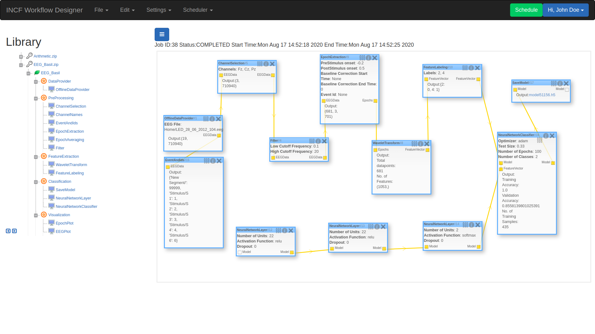

# EEG-Workflow-System

[](https://ronak66.github.io/EEG-Workflow-System)
[](https://ieeexplore.ieee.org/document/8941664)
[]()

<!--  -->

<!--  -->

## Overview
 - This project aims at building an easy to use graphical interface that can streamline the configuration of the parameters
 controlling individual processing sub-routines and thus make it easy to design complicated data flow and execute them for EEG signal processing and classification.  

 - Workflows are designed using individual component blocks that have completely configurable inputs, outputs and properties. The Blocks can be combined and rearranged at runtime without making any modification to code. 
 
 - Efforts are also targeted to make the tool user friendly and enable easy deployment of workflows on distributed computing frameworks.

  - GSoC 2020 EEG and deep learning workflow project is developed and handled by [Ronak Doshi](https://github.com/ronak66) under the guidance and mentorship of [Lukáš Vařeka](http://neuroinformatics.kiv.zcu.cz/actions/read/lukas-vareka_2015-01-27)
 
 - This project is a continuation of the project developed in Google Summer of Code 2018 by [Joey Pinto](https://github.com/pintojoey) under the mentorship of the International 
 Neuroinformatics Coordinating Facility, Sweden. The GSoC 2018 project was written in Java (server and deep-learning part)
 
 - In GSoC 2020 we are shifting the server-part and the deep-learning-part to Python (version 3.6) using Flask and Tensorflow respectively. The reason behind the shift is the availability of better deep-learning and mne libraries in python for EEG processing. There has been no change in the UI, the UI code is the same as that of gsoc2018.

 - In-order to contribute please check the [documentation](https://ronak66.github.io/EEG-Workflow-System/). It contains the system docs and contribution guide.


## Run Locally
**1. Clone the repo**
```
$ git clone https://github.com/ronak66/EEG-Workflow-System.git
$ cd EEG-Workflow-System
```
**2. Install and Create a Virtual Environment (If already installed, skip 1st command)**    
```
$ python3 -m pip install --user virtualenv
$ python3 -m venv env
$ source env/bin/activate
```
**3. Install Redis server to run the workflow in the background**  
```
$ sudo apt-get install redis-server
```
**4. Install all the required dependencies**    
```
$ pip3 install -r requirements.txt
```
**5. Setup Database**
```
$ python3 manage.py db upgrade
```
**6. Run the system**  
* Run server on one terminal
```
$ python3 server.py
```
* Run redis worker on another terminal (inside EEG-Workflow-System directory)
```
$ celery worker -A app.celery --loglevel=info
```

## Copyright
 
  
   This file is part of the EEG and Deep learning Workflow project
 
   ==========================================
  
   Copyright (C) 2020 by University of West Bohemia (http://www.zcu.cz/en/)
  
  ***********************************************************************************************************************
  
   Licensed under the Apache License, Version 2.0 (the "License"); you may not use this file except in compliance with
   the License. You may obtain a copy of the License at
  
       http://www.apache.org/licenses/LICENSE-2.0
  
   Unless required by applicable law or agreed to in writing, software distributed under the License is distributed on
   an "AS IS" BASIS, WITHOUT WARRANTIES OR CONDITIONS OF ANY KIND, either express or implied. See the License for the
   specific language governing permissions and limitations under the License.
  

