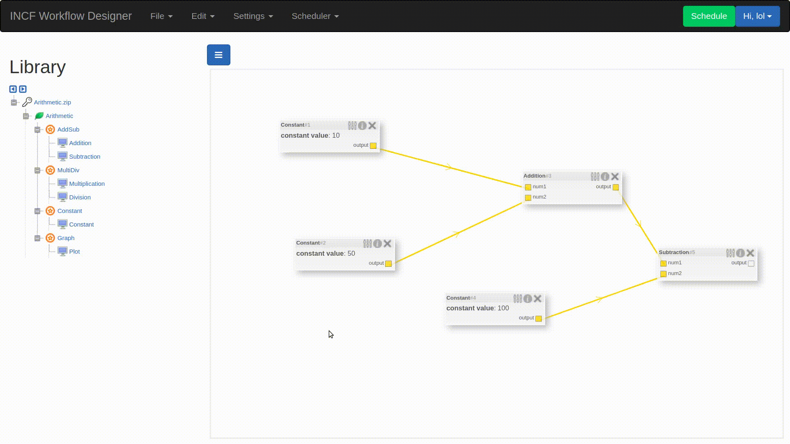

# Python-Based EEG and Deep learning Workflow Docs

## Contents of the Documentation

1. [APIs Documentation](server-api.md)
2. [How to Create Blocks](blocks.md)
3. [Workflow Execution Algorithm](workflow.md)
4. [Contribution Guide](contribute.md)

## About

- The Workflow Designer is a prototype web-based application allowing drag-and-drop creating, editing, and running workflows from a predefined library of methods. Moreover, any workflow can be exported or imported in JSON format to ensure reusability and local execution of exported JSON configurations. The application is primarily focused on electroencephalographic signal processing and deep learning workflows.

- This project aims at building an easy to use graphical interface that can assist in designing the workflow of these methods. This web-based toolkit will also assist the configuration of the parameters that control individual signal processing routines thus making it easy to design complicated signal flows and execute them. The entire workflow will be exportable and reusable as a JSON file. The GUI will use the python implementation in a way that the user will be free to implement his own methods and use them in the workflow designer. The GUI will host each signal processing method as a block and will allow users to draw data channels between them. This can then be directly be exported as a job to Spark.

- The Workflow Designer project helps you convert your python classes into visual blocks of functionality that you can combine and arrange to create workflows.

- A web application enables importing projects (custom blocks) which user can then use a drag-and-drop interface to create workflows.

## What Can You Do

### Create Workflows 

### Execute Workflow

### Upload Custom Blocks

## Try It Out

Get the code from [here (GitHub)](https://github.com/ronak66/EEG-Workflow-System) and run the system locally. Follow the instruction provided in the [README](https://github.com/ronak66/EEG-Workflow-System/README.md) to successfully build the application on your system. 

## Other links
- [GSoC 2018 Java Workflow Designer Docs](https://pintojoey.com/gsoc2018/)
- [Link to Paper - IEEE Explore](https://ieeexplore.ieee.org/document/8941664)

Copyright ©  University of West Bohemia, All rights reserved.

<!-- 
<iframe width="420" height="315"
src="https://www.youtube.com/embed/tgbNymZ7vqY">
</iframe> -->