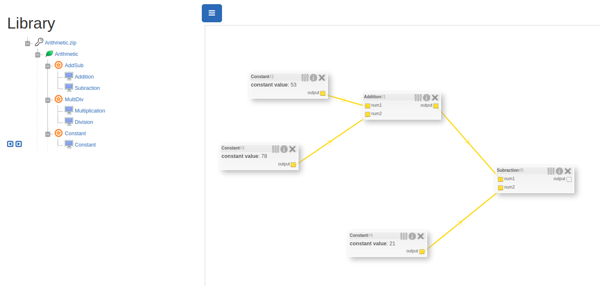
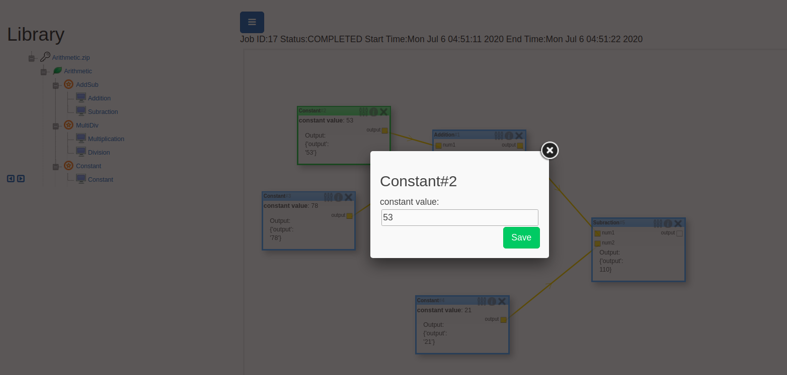

# Blocks Doccumentation


## About blocks and workflow

A block is a method which takes input and produces output when executed. Each block has editable paramters which has some default value.

A workflow is a group of blocks connected to each other where the output of one block is the input for the other. Workflows do not necessarily mean a single flow of execution, it could have multiple parallel flows.

Consider a simple workflow using Arithmetic module:
- As you can see that output of constant block is connected to input of addition block (left image).  
- Each constant block has an editable parameter deciding the value of the contant block, as seen in the bellow image (right image).   

  
    

On executing the above workflow, the result produced by the workflow is shown here  .
    

To define a block we need to specify the inputs, outputs, properties and the execution function.

The execution function may use the inputs and the properties to perform some operation and produce a single visualization and multiple outputs variables. The visualization”Previous Output” can be used to see intermediate results. The outputs (Operand3) can then be forwarded as an input to another block.

## Create New Custom Blocks

Before we learn how to create a new custom block, lets first see predefined classes:

```python
class Block(object):

    family = "Default Family"
    name = "Default Name"

    def __init__(self):
        pass

    def input_params(self,data):
        pass

    def execute(self):
        pass
```
```python
class BlockInput:

    def __init__(self,name:str, min_cardinality:int, max_cardinality:int, attribute_type:str):
        if not (isinstance(name,str) and isinstance(min_cardinality,int) and isinstance(max_cardinality,int) \
            and isinstance(attribute_type,str)):
            raise TypeError("Incorrect parameter type")
        self.name = name
        self.value = None
        self.min_cardinality = min_cardinality
        self.max_cardinality = max_cardinality
        self.attribute_type = attribute_type

    def set_value(self,value):
        self.value = value
```
```python
class BlockOutput:

    def __init__(self, name:str, attribute_type:str, min_cardinality:int, max_cardinality:int):
        if not (isinstance(name,str) and isinstance(min_cardinality,int) and isinstance(max_cardinality,int) \
            and isinstance(attribute_type,str)):
            raise TypeError("Incorrect parameter type")
        self.name = name
        self.value = None
        self.max_cardinality = max_cardinality
        self.min_cardinality = min_cardinality
        self.attribute_type = attribute_type

    def set_value(self,value):
        self.value = value
```        
```python
class BlockParameter:

    def __init__(self, name:str, attribute_type:str, defaultvalue=None):
        if not (isinstance(name,str) and isinstance(attribute_type,str)):
            raise TypeError("Incorrect parameter type")
        self.name = name
        self.value = defaultvalue
        self.attribute_type = attribute_type

    def set_value(self,value):
        self.value = value
```
```python
class ParameterType:

    NUMBER = "NUMBER"
    NUMBER_ARRAY = "NUMBER[]"
    STRING = "STRING"
    STRING_ARRAY = "STRING[]"
    FILE = "FILE"
    FILE_LOCATION = "FILE_LOCATION"
    FILE_ARRAY = "FILE[]"
    BOOLEAN = "BOOLEAN"
    OBJECT = "OBJECT"
```

To define a block in python, as shown in the last image, we need to follow few design pattern
- Every block must be a python class which should inherites the ```Block``` class (shown above)
- The new block class that you create, will overide ```input_params``` and ```execute``` method of ```Block``` class
- Input, Output and editable Parameter variable of the custom block should be instance of ```BlockInput```, ```BlockOutput``` and ```BlockParameter``` class respectively
- Create the input, output and editable parameter instance variables in the **\_\_init__** method of our custom class
- Assign value to the above variables (except output variables) in ```input_params``` method
- The ```input_params``` method takes ```data``` as only parameter. ```data``` is a dictionary of string-value pair, where key is the variable name (string) and value is the value to be assigned to that variable
- Override the ```execute``` method in which assign the value to the output varaibles
- Lastly override the ```Block``` class variables ```family``` and ```name``` to family the block belongs to and the name of the block

In-order to understand it better, lets take example of the **Arithmetic Module**.  
Arithmetic module contains 5 blocks:
- Constant Block
- Addition Block
- Subraction Block
- Multiplication Block
- Division Block

Lets see the ```Addition``` block class:
```python
import time

from blocks.Block import Block 
from blocks.BlockInput import BlockInput
from blocks.BlockParameter import BlockParameter
from blocks.BlockOutput import BlockOutput
from blocks.ParameterType import ParameterType

class Addition(Block):

    family = 'AddSub'
    name = 'Addition'

    def __init__(self):
        self.num1 = BlockInput(
            name='num1',
            min_cardinality=1,
            max_cardinality=1,
            attribute_type=ParameterType.NUMBER
        )
        self.num2 = BlockInput(
            name='num2',
            min_cardinality=1,
            max_cardinality=1,
            attribute_type=ParameterType.NUMBER
        )
        self.output = BlockOutput(
            name='output',
            min_cardinality=1,
            max_cardinality=1,
            attribute_type=ParameterType.NUMBER
        )
        

    def input_params(self,data):
        self.num1.set_value(int(data['num1']))
        self.num2.set_value(int(data['num2']))

    def execute(self):
        value = self.num1.value + self.num2.value
        self.output.set_value(value)
```
As you can see we have defined all the variables in the **\_\_init__** method and assigned all the variables (except output variables) in ```input_params``` and output variables in ```execute``` method.  

**Note:  
While uploading custom module, path to import predefined ```Block```, ```BlockInput```, ```BlockOutput```, ```BlockParameter``` and ```ParameterType``` class should be:** 
```python
from blocks.Block import Block 
from blocks.BlockInput import BlockInput
from blocks.BlockParameter import BlockParameter
from blocks.BlockOutput import BlockOutput
from blocks.ParameterType import ParameterType
```


Now lets see ```Contant``` block class:  
```python
from blocks.Block import Block 
from blocks.BlockInput import BlockInput
from blocks.BlockParameter import BlockParameter
from blocks.BlockOutput import BlockOutput
from blocks.ParameterType import ParameterType

class Constant(Block):

    family = 'Constant'
    name = 'Constant'

    def __init__(self):
        self.num = BlockParameter(
            name='constant value',
            attribute_type=ParameterType.NUMBER,
            defaultvalue=10
        )
        self.output = BlockOutput(
            name='output',
            min_cardinality=1,
            max_cardinality=1,
            attribute_type=ParameterType.NUMBER
        )

    def input_params(self,data):
        self.num.set_value(data['constant value'])

    def execute(self):
        value = self.num.value
        self.output.set_value(value)
```
As you can see it is similar to Addition block. Note that BlockParameter needs to have a default value.

Each variable input, output or parameter has ```attribute_type```. The ```arrtibute_type``` is a **string** used by the frontend to prevent connections where types does not match. For example, if block1 needs an input of *list of integers* and block2 outputs just an *integer*, then connecting output of block2 to input of block1 should not be allowed. Hence ```atrribute_type``` helps in avoiding type mis-match.  

## Create Module

Group of all the custom blocks forms a module. **Arithmetic module** consists of 5 blocks as mentioned above.

Note: For a module, always follow a proper directory structure of family. Taking Arithmetic module as an example, the structure followed by it is shown bellow:  

```bash
├── Arithmetic
   ├── AddSub
   │   ├── __init__.py
   │   ├── Addition.py
   │   ├── Subraction.py
   ├── MultiDiv
   │   ├── __init__.py
   │   ├── Multiplication.py
   │   ├── Division.py
   ├── Constant
   │   ├── __init__.py
   │   ├── Constant.py
   └── __init__.py
```

Lastly:
- The outer most **\_\_init__.py** file should contain a dictionary variable called ```string_classobject_mapping```. The ```string_classobject_mapping``` is dict with key as ```CustomBlockclass.name``` and value as the instance of the your custom block class, ```CustomBlockclass()```  
For Arithmetic module, the outermost **\_\_init__.py** file contains:  
```python
from .AddSub.Addition import Addition
from .AddSub.Subraction import Subraction
from .Constant.Constant import Constant
from .MultiDiv.Multiplication import Multiplication
from .MultiDiv.Division import Division

string_classobject_mapping = {
    Addition.name: Addition(),
    Subraction.name: Subraction(),
    Multiplication.name: Multiplication(),
    Division.name: Division(),
    Constant.name: Constant()
}
```

Check [Arithmetic Module](https://github.com/ronak66/EEG-Workflow-System/tree/master/blocks/Arithmetic) for better understanding.