# EEG Blocks Documentation

Documentation guide to all the pre-implemented EEG signal processing and classification blocks.

## Table of Content

* [Data Provider](#data-provider)
    * [Offline Data Provider](#offline-data-provider)
* [Pre Processing](#pre-processing)
    * [Channel Selection](#channel-selection)
    * [Channel Names](#channel-names)
    * [Filter](#filter)
    * [Epoch Extraction](#epoch-extraction)
    * [Epoch averaging](#epoch-averaging)
    * [Event and Ids](#event-and-ids)
* [Feature Extraction](#feature-extraction)
    * [Wavelet Transform](#wavelet-transform)
    * [Feature Labeling](#feature-labeling)
* [Classification](#classification)
    * [Neural Network Layer](#neural-network-layer)
    * [Neural Network Classifier](#neural-network-classifier)
    * [Save Model](#save-model)
* [Visualization](#visualization)
    * [EEG Plot](#eeg-plot)
    * [Epoch Plot](#epoch-plot)


## Data Provider

### Offline Data Provider
Offline Data Provider block is for importing the .eeg extension files to the workflow. These EEG data files are total 3 in number:
- < filename >.eeg
- < filename >.vhdr
- < filename >.vmrk  
```
Input: <No Inputs>
Parameter: <EEG File>
Output: EEGData
```
Note it does not allow any other EEG signal file extensions/types. 
<div id="container" style="white-space:nowrap">
    <div id="image" style="display:inline;" >
        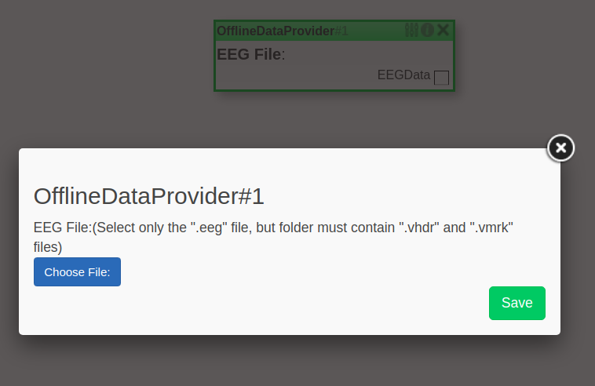
    </div>
    <div id="image" style="display:inline;">
        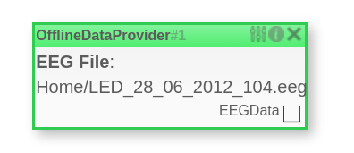
    </div>
</div>

## Pre Processing

### Channel Selection
Channel selection block as the name suggests is a block to select EEG data from some specific channels. This block takes the channel names as parameters.
```
Input: EEGData
Parameter: <Channels>
Output: EEGData
```
<div id="container" style="white-space:nowrap">
    <div id="image" style="display:inline;" >
        
    </div>
    <div id="image" style="display:inline;">
        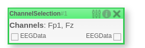
    </div>
</div>

### Channel Names
Channel names block will help to get you the list of channels and their names. This channel names will be required for channel selection block.
```
Input: EEGData
Parameter: <No Parameters>
Output: <No Outputs>
```
<div id="container" style="white-space:nowrap">
    <div id="image" style="display:inline;" >
        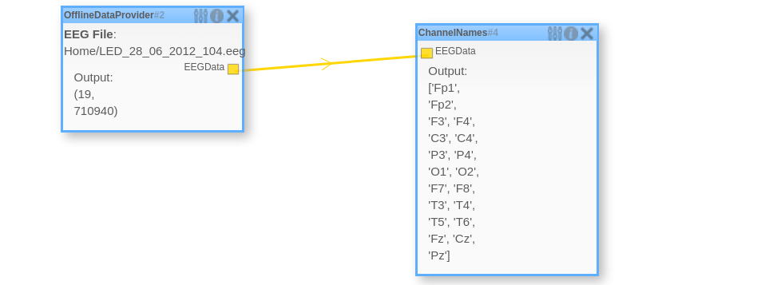
    </div>
</div>

### Filter
Filter block is nothing but a bandpass filter for all the channels in the EEG Data
```
Input: EEGData
Parameter: Low Cutoff Frequency, High Cutoff Frequency
Output: EEGData
```

<div id="container" style="white-space:nowrap">
    <div id="image" style="display:inline;" >
        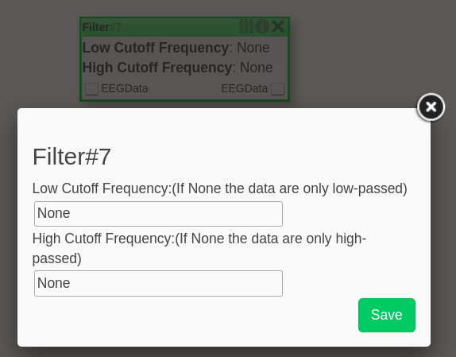
    </div>
    <div id="image" style="display:inline;">
        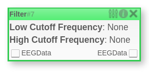
    </div>
</div>


### Epoch Extraction
Epoch extraction block extracts epoch of marked events. Given pre and post-stimulus, epoch extraction generated frames of egg data around the particular marker.
```
Input: EEGData
Parameter: PreStimulus, PostStimulus, Baseline Correction Start, Baseline Correction end, Event id
Output: Epochs
```
<div id="container" style="white-space:nowrap">
    <div id="image" style="display:inline;" >
        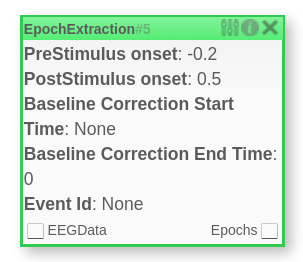
    </div>
</div>

### Epoch Averaging
As the name suggests, it computes an average of all epochs in the instance, even if they correspond to different conditions.
```
Input: Epochs
Parameter: <No Parameter>
Output: Epochs
```
<div id="container" style="white-space:nowrap">
    <div id="image" style="display:inline;" >
        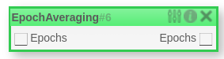
    </div>
</div>

### Event and Ids
Event and ids block will help to get you the list of event names and their corresponding ids. These ids will be required for the Epoch extraction selection block.

```
Input: EEGData
Parameter: <No Parameter>
Output: <No Output>
```

<div id="container" style="white-space:nowrap">
    <div id="image" style="display:inline;" >
        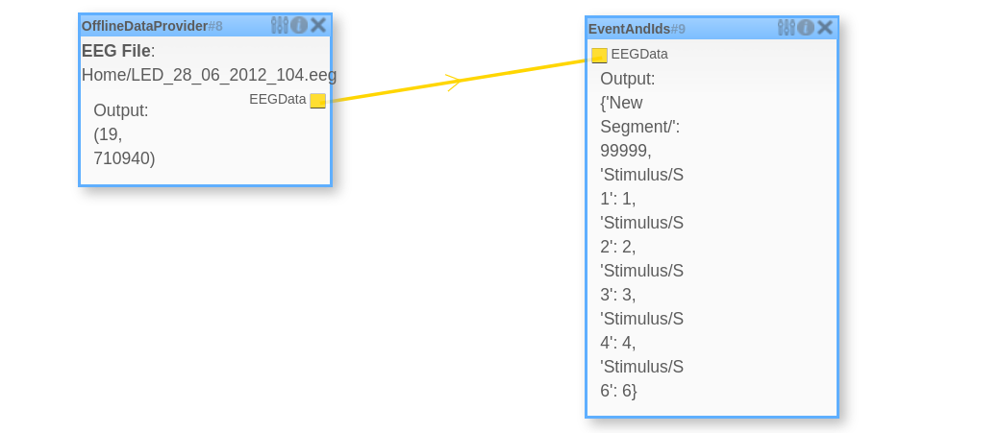
    </div>
</div>

## Feature Extraction

### Wavelet Transform
Wavelet transform block uses discrete wavelet transform (DWT) for extracting features from EEG signal. DWT is used to decompose a filtered EEG signal into its frequency components and the statistical feature of the DWT coefficient are computed in time domain.
```
Input: Epochs
Parameter: <No Parameter>
Output: FeatureVector
```

<div id="container" style="white-space:nowrap">
    <div id="image" style="display:inline;" >
        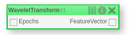
    </div>
</div>

### Feature Labeling
Feature labeling block is to label the feature vectors in order to feed it to a neural network classifier. The block maps event ids to a specific class. You can combine mutiple event ids to same class and can also discard features corresponding to an event id.
```
Input: FeatureVector
Parameter: <List of event ids>
Output: FeatureVector
```

<div id="container" style="white-space:nowrap">
    <div id="image" style="display:inline;" >
        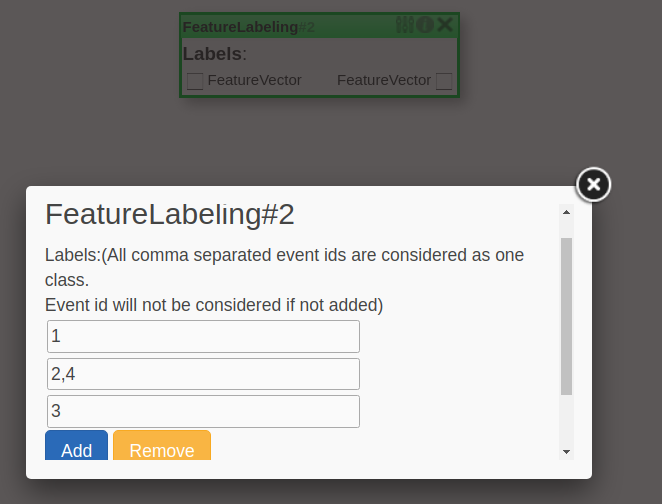
    </div>
    <div id="image" style="display:inline;">
        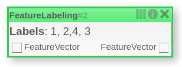
    </div>
</div>