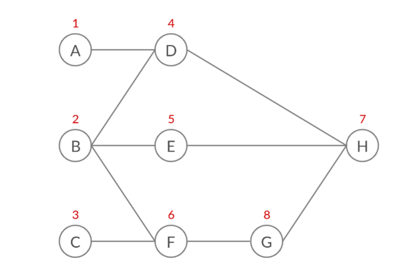

# Workflow and Execution 

Here we are going to discuss about the algorithm that we use to execute a complex graph of blocks connected to each other (workflow).

  
In order to execute the above workflow of blocks, we use simple graph theory. The frontend provides a list of blocks and edges in the workflow, using which be build a graph. The graph is nothing but an adjacency list. Note that it is a directed graph.  
To execute the workflow graph, we apply a simple BFS and execute the node we visit. But the problem arises when we visit a node whose all the input nodes are not visited (executed). So here the input for that node won't be ready and we can't execute that node.
  
Take the above graph as an example. When we apply a simple BFS, the visited sequence (as shown ubove each node in red) will be:  
1. A -> B -> C  (inital nodes)
2. A -> B -> C -> D  (adding neighbours of node A)
3. A -> B -> C -> D -> E -> F (adding neighbours of node B)
4. A -> B -> C -> D -> E -> F (already added neighbours of node C)
5. A -> B -> C -> D -> E -> F -> H (adding neighbours of node D)
6. A -> B -> C -> D -> E -> F -> H (already added neighbours of node E)
7. A -> B -> C -> D -> E -> F -> H -> G (adding neighbours of node F)
8. A -> B -> C -> D -> E -> F -> H -> G (no neighbours of node H)
9. A -> B -> C -> D -> E -> F -> H -> G (already adding neighbours of node G)

As you can see, we visited node **H** before **G**, which means we are trying to execute node **H** before we execute **G**. Here simple BFS fails as we need to execute node **G** before node **H** as node **G**'s output is connected to node **H**'s input.  

Hence we use modified BFS. Here, with the adjacency list, we also keep the adjacency list of the transpose of the graph. The adjacency list of the transpose of the graph will tell us all the inputs to a node whereas the normal adjacency list will tell us outputs from that node.
```
adjacency_list = {          |   transpose_adjacency_list = {
    A: -> D                 |       A:
    B: -> D, E, F           |       B:
    C: -> F                 |       C:
    D: -> H                 |       D: -> A, B
    E: -> H                 |       E: -> B
    F: -> G                 |       F: -> B, C
    G: -> H                 |       G: -> F
    H:                      |       H: -> D, E, G
}                           |   }
```

So, in modified BFS, when we are going to visit a node, we mark it as visited if all it's input nodes are also visited. We get the input nodes for that node from transpose_adjacency_list. If even one of the input nodes is not visited, we mark the node not-visited and continue with the BFS. By doing this, we assure that all the input nodes to that node are visited.  

Taking the example of the above graph, visited sequence will be:  
1. A -> B -> C  (inital nodes)
2. A -> B -> C -> D  (adding neighbours of node A)
3. A -> B -> C -> D -> E -> F (adding neighbours of node B)
4. A -> B -> C -> D -> E -> F (already added neighbours of node C)
5. A -> B -> C -> D -> E -> F (not adding neighbours of node D which is H, as out of (D, E, G), G is not visited)
6. A -> B -> C -> D -> E -> F (not adding neighbours of node E which is H, as out of (D, E, G), G is not visited)
7. A -> B -> C -> D -> E -> F -> G (adding neighbours of node F)
8. A -> B -> C -> D -> E -> F -> G -> H (adding neighbours of node G)
9. A -> B -> C -> D -> E -> F -> G -> H (no neighbours of node H)


